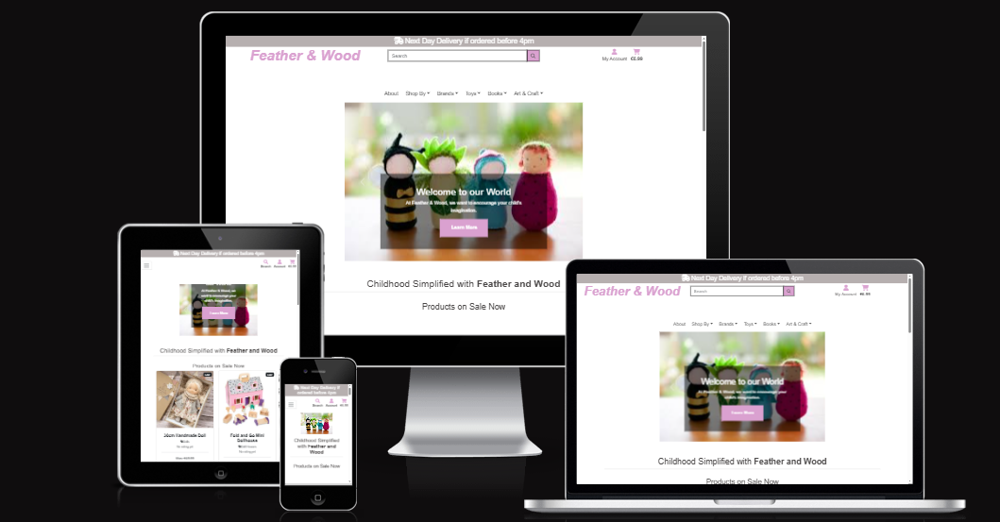
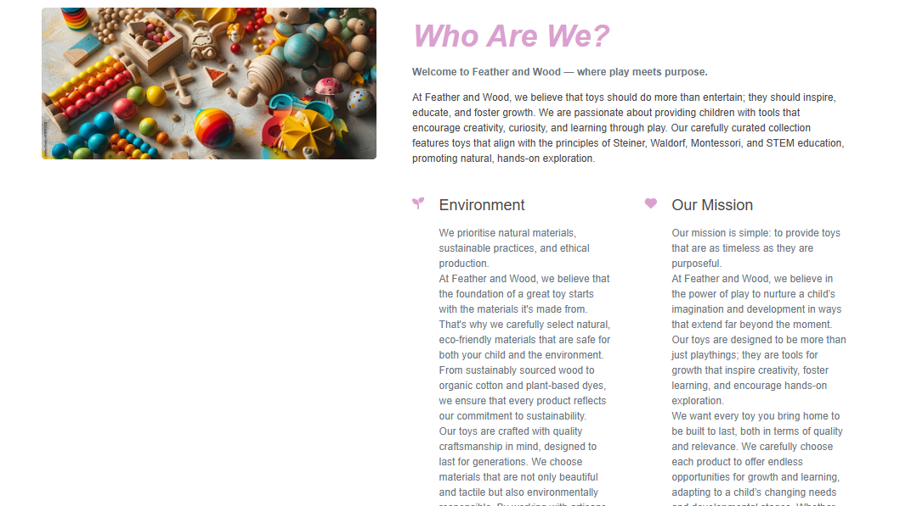
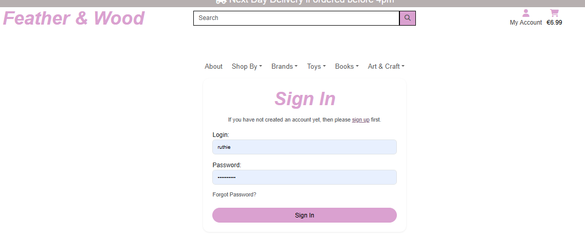

# Feather and Wood

Feather and Wood is a website that sells wooden, plush and STEM toys to those who want to engage their children in toys and games that don't have the hyper stimulation that plastic, battery toys tend to have.
Alot of these customers follow or are curious about the Montessorri or Steiner teachings, which is ultimately teaching through play, giving space for the individual child's own imagination.

## Table of Contents:

1. [User Experience(UX)](#user-experience)
   _[Strategy / Site Goals](#strategy-site-goals)
   _[Scope / User Stories](#scope-user-stories)
   _[Structure / Design](#structure-design)
   _[Colour Scheme](#colour-scheme)
   _[Fonts Used](#fonts-used)
   _[Wireframes](#wireframes)
   _[Database Schema](#database-schema)
   _[Agile Methodology](#agile-methodology)
2. [Features](#features)
3. [Marketing](#marketing)
4. [SEO](#seo)
5. [Testing](#testing)
6. [Bugs](#bugs)
7. [Technologies and Languages](#technologies-and-languages)
8. [Deployment](#deployment)
   _[Cloning](#cloning)
   _[Forking](#forking)
9. [Credits](#credits)

## User Experience

### <ins>Strategy / Site Goals:</ins>

As a B2C(Business to Consumer) website, our goal is to create an easy-to-use, intuitive site that gives the consumer a great shopping experience. With features such as an easy payment gateway, a trusted authentication system, a search
and filter feature, high quality images, clear product descriptions, a ratings/review feature, a shopping cart overview, being just some, we are confident we will meet the ultimate goal for our users, consumers and owners alike.

### <ins>Scope / User Stories:</ins>

#### As a customer, I want to...:

1. Be able to see this is the right website for me by the HomePage. It will be clear as to it's purpose from the first time I visit it.
2. Be able to see products available and click into them for more information
3. Be able to clearly see a price and a reduction in price if it is on sale.
4. Be able to visit the Page's About Me section to see if the company's goals and ethics are similar to my own.
5. Be able to make a purchase without having to register as a user first.
6. Be able to search for a certain product that I know by name.
7. Be able to view what is in my cart.
8. Be able to edit my cart to either increase or decrease a quantity.
9. Be able to delete my cart or certain items in my cart.
10. Be able to enter my payment info, with the knowledge it is a trusted site.
11. Be able to view my order confirmation after I have checked out.
12. Be able to recieve an order confirmation email.
13. Be able to register for an account
14. Be able to login / logout easily.
15. Be able to recover my password if I forget it.
16. Be able to have a personalised user profile, where I can see my past orders.

#### As a site owner/Admin, I want to...:

1. Be able to have an overview of all models on the site.
2. Be able to have full CRUD functionality for products, sales etc
3. Be able to see orders and customer details.

Click to view KanBan

### <ins>Structure / Design:</ins>

#### Colour Scheme:

Talk of colour scheme here........................

#### Fonts Used:

Talk of Google fonts here........................

#### Wireframes:

I used Balsamiq to create the wireframe for the project.

Click to view Wireframes

[Back to Top](#feather-and-wood)

#### Database Schemas:

##### <ins>User Model</ins>

As part of the Django built-in AllAuth library, this model holds information about the User.

- id: PrimaryKey
- username: CharField
- password: Charfield
- email: EmailField
- is_superuser: BooleanField

##### <ins>Product Model</ins>

The Product Model object represents the products on sale, created by the SuperUser. It consists of the following fields:

- id: PrimaryKey
- name: Charfield
- category: ForeignKey
- brand: ForeignKey
- rrp_price: DecimalField
- sale_price: DecimalField
- details: TextField
- description: CharField
- rating: DecimalField
- discount: DecimalField
- image_url: UrlField
- image: ImageField

##### <ins>User Profile Model</ins>

- id: PrimaryKey
- user: OneToOne
- default_phone_number: CharField
- default_street_address1: CharField
- default_street_address2: CharField
- default_city: CharField
- default_county: CharField
- default_postcode: CharField
- default_country: CountryField

##### <ins>Order Model</ins>

- id: PrimaryKey
- order_number: CharField
- user_profile: ForeignKey
- full_name: CharField
- email: EmailField
- phone_number: CharField
- street_address1: CharField
- street_address2: CharField
- city: CharField
- county: CharField
- postcode: CharField
- country: CountryField
- date: DateTimeField
- delivery_cost: DecimalField
- order_total: DecimalField
- grand_total: DecimalField

##### <ins>Order Line Item Model</ins>

- id: PrimaryKey
- order: ForeignKey
- product: ForeignKey
- quantity: IntegerField
- lineitem_total: DecimalField

##### <ins>Category Model</ins>

- id: PrimaryKey
- name: Charfield
- friendly_name: CharField

##### <ins>Review Model</ins>

- id: PrimaryKey
- user_profile: ForeignKey
- product: ForeignKey
- product_rating: IntegerField
- title: CharField
- user_review : TextField
- date_created: DateTimeField

##### <ins>Wishlist Model</ins>

- id: PrimaryKey
- user_profile: ForeignKey
- product: ManyToMany

##### <ins>Brand Model</ins>

- id: PrimaryKey
- name: Charfield
- friendly_name: CharField
- image_url: UrlField
- image: ImageField

Click to view ERD

[Back to Top](#feather-and-wood)

#### Agile Methodology:

Adopting the Agile method for this project, I was able to break down the huge and overwhelming feat of the tasks it would take to get
this project, not only off the ground but as an up and running working software solution!
By breaking down the tasks into increments, I was easily able to modify or add as needed.

Starting with basic User Stories, I was able to break these down into Epics and then Sprints.

##### <ins>Epic 1:</ins>

Related to User Stories: #

##### Sprint 1:
Create the site's basic structure and functionality

Tasks:

1. Create Django project and basic folder structure
2. Set up User Authentication with AllAuth
3. Create Database models for Products, Users and Orders
4. Create a Product Detail Template with Bootstrap

##### <ins>Epic 2:</ins>

Related to User Stories: #

##### Sprint 2:
Implement CRUD functionality and expand on website features

Tasks:

1. Implement CRUD for Admin on products, categories etc
2. Create a shopping cart for adding, editing and removing items(order and OrderLineItem)
3. Install Stripe API to use for secure payments

##### <ins>Epic 3:</ins>

Related to User Stories: #

##### Sprint 3:
Focus on UX(User Experience) by adding extra features to the site

Tasks:

1. Create a Search Bar to search for brands, products etc
2. Create a Review model, so users can review items they have bought.
3. Create a Wishlist model, so users can add products to their wishlist once they are registered.
4. Create a Brand Model, so users can search by well-known manufacturer titles.

##### <ins>Epic 4:</ins>

Related to User Stories: #

##### Sprint 4:
Test all features manually, push final deploy and finish any documentation

Tasks:

1. Test all features once finally deployed
2. Fix and document any bugs
3. Note testing in docs

[Back to Top](#feather-and-wood)

## Features:

##### 1. Navbar

Click to view NavBar

##### 2. Toasts

Click to view Toasts

##### 3. Footer

Click to view Footer

##### 4. Home Page

Click to view Home Page

    * Hero Section - Image Carousel
    

Click to view Hero Section

    

    * Featured Products Area - Products on Sale
    

Click to view Featured Products

    

- Newsletter Signup

Click to view Newsletter Signup

    

[Back to Top](#feather-and-wood)

##### 5. Product Page

Click to view Product Page

- Single Product Card

Click to view Single Product Card

    

- Product Details Page
   This Page is rendered when a user clicks on a certain product in order to see a more detailed view of what the product is.

Click to view Product Details Page

- Review Product - Create

Click to view Review Product - Create

    

- Review Product - Edit

Click to view Review Product - Edit

    

- Review Product - Delete

Click to view Review Product - Delete

    

##### 6. About Page

Click to view About Page

##### 7.User Profile Page

Click to view User Profile Page

This page will hold the customers past orders and delivery information, their wishlist and reviews will also be available to edit or delete here.

##### 8. Shopping Cart Page

Click to view Shopping Bag Page

When a user chooses and item to buy, it will be added to the cart page. When the cart icon is clicked, the user will be brought to the cart page to see details of what they would like to buy, with product name, amount, individual cost and total.

##### 9. Checkout Page

Click to view Checkout Page

When the customer decides they have finished shopping and would like to checkout their products, they will click on the checkout button. From here, they will brought to the checkout page, where they will enter their personal details, such as name, address, phone number etc.They will also enter their valid credit/debit card details securely using Stripe and click Pay Now button.

##### 10. Order Confirmation Page

Click to view Order Confirmation Page

When payment has been successful, an order confirmation page will display for the user. Here it will show details of the order and a message to say that an email will also be sent

[Back to Top](#feather-and-wood)

- Past orders

Click to view Past Order sample

In the user's profile page, they will be able to see a list of their past purchases and click on any of them to review.

##### 11. Administration Page Overview

Click to view Administration Page Overview

Functionality to add new products, new brands, edit or delete products/brands. They will have access to view order details such as customer name,address and phone number and what they ordered.

##### 12. Register/Login Pages

Click to view Register and Login Pages

Custom register and login pages are provided using django’s allauth system. The layout of the pages are simple, user-friendly and a bit more aesthetically pleasing than the default page that Django provides.

##### 13. Sign Out Page

Click to view Sign Out Page

Custom sign out page, making logging out simple and user intuitive. A message will appear to confirm that user is logged out to give better piece of mind that their details are safe.

### Future Features:
Features I didn't have time for or would like to implement in the future:
1. Free Delivery over a certain threshold
2. Loyalty Card
3. Pre-Order on items due in stock

[Back to Top](#feather-and-wood)

## Marketing:

Business Model: 
Marketing:
To keep customers up to date with social media, Feather and Wood has a Facebook page, which is linked in the footer. Here, the site is updated daily with either stories or posts or both, some of which will ask for interaction with customers to keep them engaged and to keep our content relevant and consistently in the customers mind’s eye. 

You can view it here: [Link to Facebook Page](https://www.facebook.com/profile.php?id=61574163059661#)

Customers can also signup to Feather and Woods Newsletter. This is done using MailChimp. You do not need to be a registered user to sign up. It is a simple, enter email address function, with a successful message display. 

It is located near the footer here:

## SEO:Search Engine Optimisation:

To help improve our SEO, I made a sitemap.xml via [sitemap.xl.com](https://www.xml-sitemaps.com/) and a robots.txt file, located in the root folder of the project, enhancing the site's crawlability, indexability, and relevance. As per advise, I avoided including duplicate, canonical, redirected, or blocked pages. I used the most-used words relating to Steiner and Waldorf education toys and toys in general to engage as many customers as possible.

## Testing:
Please see [this document](assets\TESTING.md) for details of testing

## Bugs:
After connecting my Heroku app and AWS S3 Bucket for serving media and static files, the app stopped connecting.
To fix this:I figured out that I needed to reconfigure my CORS policy.

[Back to Top](#feather-and-wood)

## Technologies and Languages:

WRITE THEM HERE!!!!!!!!!!!!!!!!!

## Deployment:
I deployed this project to Heroku, but used AWS S3 to store all media and static files.
To deploy to Heroku, I used the following steps:

1. Login to Heroku.com and on the Dashboard, click "Create New App". Give the app a unique name
   and set your region.
2. On the "Resources" tab, supply a new Heroku Postgres database
3. On the "Settings" tab, click on "Reveal Config Vars". Add variables as you get them
4. The variables needed for this project are as follows:
   | Key      | Value |
   | ----------- | ----------- |
   | AWS_ACCESS_KEY_ID      | 'your access key id from AWS'       |
   | AWS_SECRET_ACCESS_KEY   | 'your secret access key id from AWS'        |
   | DATABASE_URL   | 'your database url        |
   | EMAIL_HOST_PASS   | 'your app password from email'        |
   | EAMIL_HOST_USER   | 'your email address'        |
   | SECRET_KEY   | 'your secret key'        |
   | STRIPE_PUBLIC_KEY   | 'your stripe public key'        |
   | STRIPE_SECRET_KEY   | 'your stripe secret key'        |
   | USE_AWS   | True        |

### Cloning:
Create a local copy of the remote repository on your machine:
1. Go to the GitHub repository you want to clone.
2. Click the "Code" button (green button on the top right of the repo page).
3. Copy the URL (either HTTPS or SSH link). 

For example:

`HTTPS: https://github.com/username/repository-name.git`

`SSH: git@github.com:username/repository-name.git (You’ll need SSH keys set up for this).`

4. Open Terminal/Command Prompt
5. Navigate to the Directory Where You Want to Clone
6. Use the following command, replacing the URL with the one you copied earlier:

`git clone https://github.com/username/repository-name.git`

OR if using SSH:

`git clone git@github.com:username/repository-name.git`

This will download the repo to your local machine.

### Forking:
Create your own copy of someone else’s repository under your GitHub account. 
This is useful when you want to make changes or contribute to the original repository without affecting it directly.

1. Go to the Repository Page and open your web browser and go to the repository you want to fork on GitHub.
2. On the top right of the repository page, you will see a "Fork" button. Click on it.
GitHub will automatically create a copy of the repository under your GitHub account. It will redirect you to your forked repo once the process is complete.
3. Clone Your Forked Repo as above, to your local machine. Instead though use the URL of your forked repo(it will be https://github.com/your-username/repository-name.git)

If you want to contribute your changes to the original repository, you can create a Pull Request from your fork to the original repository.

## Credits:
1. I relied quite heavily on the Boutique Ado walkthrough project from Code Institute for this project as time was not on my side.
2. OpenAi - ChatGpt for problem solving and further understanding when I couldn't find the answers elsewhere.
3. Stack Overflow for problems that I searched for.
4. The wonderful Slack community - most of my searches brought something up here and it was nice to know I was not the only one facing certain problems!

[Back to Top](#feather-and-wood)