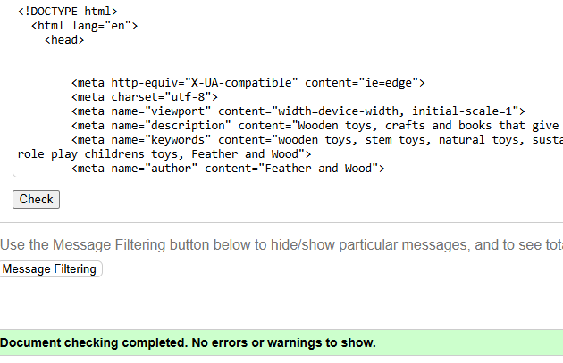
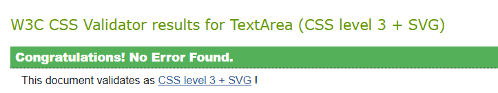

#  Testing: Feather and Wood

This document outlines the testing strategy and results for the **Feather and Wood** Django-based e-commerce site. Testing covers manual functional tests, Lighthouse audits,  third-party integrations, accessibility, and known issues.

---

## ✅ Manual Testing

###  Core Pages

| Page                | Tested? | Notes                                   |
|---------------------|--------|-----------------------------------------|
| Homepage            | ✅     | Loaded quickly, no layout issues        |
| Product List        | ✅     | Pagination, filtering, sorting verified |
| Product Detail      | ✅     | Image zoom, review form tested          |
| Wishlist Page       | ✅     | Add/remove items tested                 |
| User Profile        | ✅     | Info update, order history confirmed    |
| 404 Error Page      | ✅     | Triggered via non-existent URL          |

---

###  Manual Test Checklist

| Feature                                | Scenario Tested                                         | Result |
|----------------------------------------|----------------------------------------------------------|--------|
| Responsive layout                      | Resized on desktop, tablet, mobile                      | ✅     |
| Navbar & Footer                        | Checked across all screen sizes                         | ✅     |
| Add to Wishlist                        | From product page and product list                      | ✅     |
| Product Reviews                        | Submit, edit, and validate review form                  | ✅     |
| User Registration                      | Valid/invalid input, duplicate emails                   | ✅     |
| Login/Logout                           | Sessions, redirects, "remember me"                      | ✅     |
| Stripe Checkout                        | Test card input, success, and failure scenarios         | ✅     |
| Contact Form                           | Valid input, empty fields, email send confirmation      | ✅     |
| Email Signup (Mailchimp)              | Subscribed, duplicate email, error handling             | ✅     |
| Social Login (Google/Facebook)         | Login, logout, permissions checked                      | ✅     |
| 404 Page                               | Access `/this-does-not-exist` URL                       | ✅     |
| Social Media Links | Opens in new tab | ✅ |
| Toasts | Popup messages appear for user feedback| ✅ |
| Footer links | Link open in new page at correct location | ✅|
| Dropdown Menu | Categories are shown | ✅|
| Wishlist Feature | Only works when logged in |  ✅|
| Wishlist listed | On profile page|  ✅|
| Wishlist delete | wishlist item can be deleted |  ✅|
| Sorting Feature | User sorts in ascend/descend order |  ✅|
| Search bar | use keywords to search site |  ✅|
| Product Detail | Single product is shown |  ✅|
| Review facility| CRUD working|  ✅|
| List of reviews| shown on profile page |  ✅|
| Product review| Shows in Customer reviews on product detail page | ✅|
|Admin site| Full admin functionality|  ✅|
---

##  Lighthouse Performance Audits

### Desktop

| Metric         | Score |
|----------------|-------|
| Performance    | 98    |
| Accessibility  | 100   |
| Best Practices | 96   |
| SEO            | 97   |

### Mobile

| Metric         | Score |
|----------------|-------|
| Performance    | 92    |
| Accessibility  | 100   |
| Best Practices | 100   |
| SEO            | 98    |

---

### Run Tests

#### Accessibility & Code Validation:

|Tool	|Outcome	|URL|
--------|-----------|----
|W3C HTML Validator	|✅ No errors	|https://validator.w3.org|
|JSHint	|✅ ES6 validated	|https://jshint.com|
| Jigsaw Validator | ✅ No errors | https://jigsaw.w3.org/css-validator/validator
|WAVE (Accessibility)	|✅ Minor contrast warnings	|https://wave.webaim.org|

All pages were tested through the W3C Validator for html and they passed.

Css was tested through the Jigsaw validator and passed.

#### Third-Party Integration Testing:

|Service	|Functionality	|Tested?	|Notes|
--------|---------|---------|--
|Stripe|	Secure payment processing	|✅|	Test mode with Stripe test cards|
|Mailchimp|	Newsletter signup	|✅	|Confirmed with test list|
|Google Auth	|Social login via Google	|✅	|Logged in and profile populated|
|Facebook Auth	|Social login via Facebook	|✅	|Permissions and logout tested|

#### Known Issues / still To-Do:

|Issue	|Status	|Notes|
--------|-------|---------
|Critical CSS loading	|⚠️|	Identified, but will be addressed later|
|Bootstrap unused CSS warning	|⚠️|	Minor, from Lighthouse report|
|Image loading performance on S3	|⚠️	|Needs image compression|

